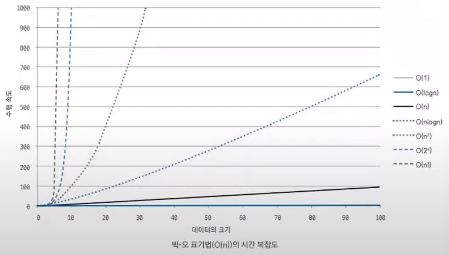

안녕하세요~👋

오늘도 공부하는 무럭무럭 ✨`성장몬`✨ 입니다. 

<br>

지난 Database 포스팅에 시간복잡도를 고려해서 문제를 푸는 분들이 있어

더 열심히 해야겠다고 다짐했었는데요!

시간복잡도를 고려하려면~

시간복잡도가 뭔지 알아야겠죠?! 🤭

마침 관련 강의를 발견해서 듣고서 포스팅해 봅니다^_^*

<br>

같이 성장하고 싶다면~?

+ [인프런](https://www.inflearn.com/) > [Do it! 알고리즘 코딩테스트 with JAVA](https://inf.run/kZnd) > 섹션 0.코딩테스트 준비하기 > [시간복잡도](https://www.inflearn.com/course/lecture?courseSlug=%EB%91%90%EC%9E%87-%EC%95%8C%EA%B3%A0%EB%A6%AC%EC%A6%98-%EC%BD%94%EB%94%A9%ED%85%8C%EC%8A%A4%ED%8A%B8-%EC%9E%90%EB%B0%94&unitId=148247)

+ [하루코딩](https://www.youtube.com/@codingtest) > [Do it! 알고리즘 코딩테스트 - 핵심이론 강의](https://youtube.com/playlist?list=PLFgS-xIWwNVX-zm4m6suWC9d7Ua9z7fuT) > [시간복잡도](https://youtu.be/XncTU-4i1KI)

<br>

<br>

[TOC]

<br>

# **01 어떤 알고리즘으로 풀어야 할까?**

ㅡ 알고리즘 선택의 기준이 되는 시간 복잡도

---

코딩 테스트의 핵심 중 하나는 문제마다 주어진 시간 복잡도를 고려해

적절한 알고리즘을 선택하는 것입니다.

처음에 알고리즘을 잘못 선택하면 아무리 코드를 잘 짜려고 노력해도

좋은 결과를 거두기 어려우니까요.

문제를 본격적으로 풀어 보기 전에 시간 복잡도를 표기하는 방법과

활용하는 방법을 익혀 보겠습니다.

<br>

<br>

## **01-1 시간 복잡도 표기법 알아보기**

알고리즘에서 시간 복잡도는 주어진 문제를 해결하기 위한 연산 횟수를 말합니다. 일반적으로 수행 시간은 1억 번의 연산을 1초의 시간으로 간주하여 예측합니다.

<br>

### 💙 **시간 복잡도 정의하기**

실제 시간 복잡도를 정의하는 3가지 유형은 다음과 같습니다.

> 시간 복잡도 유형

* 빅-오메가(Ω(n)): 최선일 때(best case)의 연산 횟수를 나타낸 표기법
* 빅-세타(Θ(n)): 보통일 때(average case)의 연산 횟수를 나타낸 표기법
* 빅-오(O(n)): 최악일 때(worst case)의 연산 횟수를 나타낸 표기법

<br>

다음은 0~99 사이의 무작윗값을 찾아 출력하는 코드입니다. 빅-오메가 표기법(Ω(n))의 시간 복잡도는 1번, 빅-세타 표기법(Θ(n))의 시간 복잡도는 2/N번, 빅-오 표기법(O(n))의 시간 복잡도는 N번입니다.

> 시간 복잡도 예제 코드

```java
public class timeComplexExample1 {
    public static void main(String[] args) {
        // 1~100 사이 값 랜덤 선택
        int findNumber = (int)(Math.random() * 100);
        for(int i= 0; i < 100; i++) {
            if(i == findNumber){
                System.out.print(i);
                break;
            }
        }
    }
}
```

<br>

### 💙 **코딩 테스트에서는 어떤 시간 복잡도 유형을 사용해야 할까?**

`코딩 테스트에서는 빅-오 표기법(Ο(n))을 기준으로 수행 시간을 계산하는 것`이 좋습니다. 실제 테스트에서는 1개의 테스트 케이스로 합격, 불합격을 결정하지 않습니다. 응시자가 작성한 프로그램으로 다양한 테스트 케이스를 수행해 모든 케이스를 통과해야만 합격으로 판단하므로 시간 복잡도를 판단할 때는 최악일 때 *worst case*를 염두에 둬야 합니다.

다음은 빅-오 표기법(Ο(n))으로 표현한 시간 복잡도 그래프입니다. 각각의 시간 복잡도는 데이터 크기(N)의 증가에 따라 성능(수행 시간)이 다르다는 것을 확인할 수 있습니다.



<br>

다음 절에서는 이러한 내용을 바탕으로 시간 복잡도의 개념을 코딩 테스트에 어떻게 활용해야 하는지 알아보겠습니다.

<br>

<br>

## **01-2 시간 복잡도 활용하기**

### 💙 **알고리즘 선택의 기준으로 사용하기**

우리가 이 책에서 정렬 부분의 학습을 완료했고, 버블 정렬과 병합 정렬의 시간 복잡도를 각각 Ο(n²), Ο(nlogn)이라고 알고 있다고 가정하고 다음 문제를 예로 들어 설명하겠습니다.

<br>

#### **문제 000 🎁 수 정렬하기**

N개의 수가 주어졌을 때 이를 오름차순 정렬하는 프로그램을 작성하시오.

+ 시간 제한 2초
+ 백준 온라인 저지 2750번

<br>

📥 입력

1번째 줄에 수의 개수 N(1 ≤ N ≤ 1,000,000), 2번재 줄부터는 N개의 줄에 숫자가 주어진다. 이 수는 절댓값이 1,000,000보다 작거나 같은 정수다. 수는 중복되지 않는다.

📤 출력

1번째 줄부터 N개의 줄에 오름차순 정렬한 결과를 1줄에 1개씩 출력한다.

+ 예제 입력 1

  ```
  5
  5
  2
  3
  4
  1
  ```

+ 예제 출력 1

  ```
  1
  2
  3
  4
  5
  ```

  

시간 제한이 2초이므로 이 조건을 만족하려면 2억 번 이하의 연산 횟수로 문제를 해결해야 합니다. 따라서 문제에서 주어진 시간 제한과 데이터 크기를 바탕으로 어떤 정렬 알고리즘을 사용해야 할 것인지를 판단할 수 있습니다.

<br>

✅ 연산 횟수는 1초에 1억 번 연산하는 것을 기준으로 생각합니다.

✅ 시간 복잡도는 항상 최악일 때, 즉 데이터의 크기가 가장 클 때를 기준으로 합니다.

<br>

> 연산 횟수 계산 방법

+ 연산 횟수 = 알고리즘 시간 복잡도 X 데이터의 크기

<br>

위 공식을 대입해 각 알고리즘이 이 문제에 적합한지 판단해 보겠습니다.

> 알고리즘 적합성 평가

+ 버블 정렬 = (1,000,000)² = 1,000,000,000,000 > 200,000,000 → 부적합 알고리즘

+ 병합 정렬 = 1,000,000log(1,000,000) = 약 20,000,000 < 200,000,000 → 적합 알고리즘

<br>

문제에 주어진 시간 제한이 2초이므로 연산 횟수 2억 번 안에 원하는 답을 구해야 합니다. 버블 정렬은 약 10억 번의 연산 횟수가 필요하므로 이 문제를 풀기에 적합한 알고리즘이 아니라고 판단할 수 있습니다. 병합 정렬을 약 2,000만 번의 연산 횟수로 답을 구할 수 있으므로 문제를 풀기에 적합한 알고리즘이라고 판단할 수 있습니다.

이와 같이 시간 복잡도 분석으로 문제에서 사용할 수 있는 알고리즘을 선택할 수 있고, 이 범위를 바탕으로 문제의 실마리를 찾을 수 있습니다. 즉, 데이터의 크기(N)를 단서로 사용해야하는 알고리즘을 추측해 볼 수 있습니다.

<br>

### 💙 **시간 복잡도를 바탕으로 코드 로직 개선하기**

시간 복잡도는 작성한 코드의 비효율적인 로직을 개선하는 바탕으로도 사용할 수 있습니다. 이 부분을 활용하려면 가장 먼저 코드의 시간 복잡도를 도출할 수 있어야 합니다. 시간 복잡도를 도출하려면 다음 2가지 기준을 고려해야 합니다.

> 시간 복잡도 도출 기준

① 상수는 시간 복잡도 계산에서 제외한다.

② 가장 많이 중첩된 반복문의 수행 횟수가 시간 복잡도의 기준이 된다.

<br>

코드를 예로 들어 설명하겠습니다.

> 연산 횟수가 N인 경우

```java
public class 시간복잡도_판별원리1 {
	public static void main(String[] args) {
		int N = 100000;
		int cnt = 0;
		for (int i = 0; i < N; i++) {
			System.out.println("연산 횟수:" + cnt++);
		}
	}
}
```

> 연산 횟수가 3N인 경우

```java
public class 시간복잡도_판별원리2 {
	public static void main(String[] args) {
		int N = 100000;
		int cnt = 0;
		for (int i = 0; i < N; i++) {
			System.out.println("연산 횟수:" + cnt++);
		}
		for (int i = 0; i < N; i++) {
			System.out.println("연산 횟수:" + cnt++);
		}
		for (int i = 0; i < N; i++) {
			System.out.println("연산 횟수:" + cnt++);
		}
	}
}
```

두 예제 코드의 연산 횟수는 3배의 차이가 납니다. 언뜻 생각하면 큰 차이인 것 같지만 `코딩 테스트에서는 일반적으로 상수를 무시`하므로 두 코드 모두 시간 복잡도는 Ο(n)으로 같습니다.

<br>

다음 예제 코드를 확인해 보겠습니다.

> 연산 횟수가 N²인 경우

```java
public class 시간복잡도_판별원리3 {
	public static void main(String[] args) {
		int N = 100000;
		int cnt = 0;
		for(int i = 0; i < N; i++) {
			for (int j = 0; j < N; j++) {
				System.out.println("연산 횟수:" + cnt++);
			}
		}
	}
}
```

`시간 복잡도는 가장 많이 중첩된 반복문을 기준으로 도출하므로` 이 코드에서는 이중 for 문이 전체 코드의 시간 복잡도 기준이 됩니다. 만약 일반 for 문이 10개 더 있다 하더라도 도출 원리의 기준 ②에 따라 시간 복잡도의 변화 없이 N²으로 유지됩니다.

이와 같이 자신이 작성한 코드의 시간 복잡도를 도출할 수 있다면 실제 코딩 테스트에서 시간 초과가 발생했을 때 이 원리를 바탕으로 문제가 되는 코드 부분을 도출할 수 있고, 이 부분을 연산에 더욱 효율적인 구조로 수정하는 작업으로 문제를 해결할 수 있습니다.