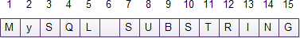
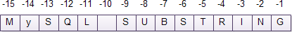

안녕하세요~👋

오늘도 공부하는 무럭무럭 ✨`성장몬`✨ 입니다.

<br>

🌷중요🌷 position이 0이면 빈 문자열을 반환한다!

※ 오라클(Oracle)에서는 position이 0이면 1로 간주하고 결과값을 반환한다.

<br>

position 은 1부터! 거꾸로는 -1부터!

<br>

위치(position)뿐 아니라 길이(length)도 지정하는 경우에

위치(position)와 길이(length)의 합이 문자열의 문자 수보다 크면

지정한 위치에서 시작해서 문자열의 끝까지 반환한다!

```sql
SELECT SUBSTRING('MySQL SUBSTRING',7,10); -- SUBSTRING

SELECT SUBSTRING('MySQL SUBSTRING',7,20); -- SUBSTRING
```
※ 오라클(Oracle)도 마찬가지

<br>

그리고 SUBSTR, SUBSTRING 은 동의어!

😝 같은 말이다! 차이가 없다! 

<br>

같이 성장하고 싶다면~?

+ [MySQL Tutorial 공식문서](https://www.mysqltutorial.org/)

+ [MySQL String Functions](https://www.mysqltutorial.org/mysql-string-functions/) > [MySQL SUBSTRING Function](https://www.mysqltutorial.org/mysql-substring.aspx)

<br>

<br>


# 🔎 **MySQL SUBSTRING Function**

> **Summary** : 

in this tutorial, we will introduce you to the **MySQL SUBSTRING** function that extracts a substring from a string.

---

<br>

The `SUBSTRING` function returns a substring with a given length from a string starting at a specific position. MySQL provides various forms of the substring function.

<br>

We will examine each form of the `SUBSTRING` function in the following sections.

<br>

## ✅ **MySQL SUBSTRING with position parameter**

The following illustrates the first form the `SUBSTRING` function:

```sql
SUBSTRING(string,position);
SUBSTRING(string FROM position);
```
<br>

The substring() function has two parameters:

1. The `string` specifies the string that you extract the substring.
2. The `position` is an [integer](https://www.mysqltutorial.org/mysql-int/) that specifies the starting character of the substring. The `position` can be a positive or negative integer.

<br>

If the position is positive, the `SUBSTRING` function extracts the substring from the start of the string. See the following string.



<br>

For example, to get the ” `SUBSTRING`” out of the ” `MySQL SUBSTRING`” string, the position of the substring must be 7 as the following `SELECT` statement:

```sql
SELECT SUBSTRING('MYSQL SUBSTRING', 7); -- SUBSTRING
```

<br>

If the position is negative, the `SUBSTRING` function extracts the substring from the end of the string. See the following ” `MYSQL SUBSTRING`” string:



<br>

To get the ” `SUBSTRING`” out of the ” `MySQL SUBSTRING`” using a negative position, you must pass `-10` to the `position` argument as follows:

```sql
SELECT SUBSTRING('MySQL SUBSTRING',-10); --  SUBSTRING
```

<br>

Notice that if the position is zero, the `SUBSTRING` function returns an empty string:

```sql
SELECT SUBSTRING('MYSQL SUBSTRING', 0); -- ''
```

Besides the MySQL-specific syntax, you can use SQL-standard syntax with the `FROM` keyword to call the `SUBSTRING` function.

<br>

For example, the following statement gets the `SUBSTRING` from the `MySQL SUBSTRING` string using the SQL-standard syntax:

```sql
SELECT SUBSTRING('MySQL SUBSTRING' FROM -10);
```

<br>

## ✅ **MySQL SUBSTRING with position and length**

If you want to specify the length of the substring that you want to extract from a string, you can use the following form of the `SUBSTRING` function:

```sql
SUBSTRING(string,position,length);
```

<br>

The following is the SQL-standard version of the above statement, which is longer but more expressive.

```sql
SUBSTRING(string FROM position FOR length);
```

Besides the string and position arguments, the `SUBSTRING` function has an additional length argument. The length is a positive integer that specifies the number of characters of the substring.

If the sum of position and length is greater than the number of characters of the string, the `SUBSTRING` function returns a substring starting from the position to the end of the string.

For example, to get the ” `MySQL”` from the ” `MySQL SUBSTRING`“, you use the following statement:


```sql
SELECT SUBSTRING('MySQL SUBSTRING',1,5); -- MySQL
```
Or
```sql
SELECT SUBSTRING('MySQL SUBSTRING' FROM 1 FOR 5); -- MySQL
```

<br>

In case you want to use the negative position, you use the following statement:


```sql
SELECT SUBSTRING('MySQL SUBSTRING',-15,5); -- MySQL
```
Or with the `FROM FOR` syntax:
```sql
SELECT SUBSTRING('MySQL SUBSTRING' FROM -15 FOR 5); -- MySQL
```

<br>

The `SUBSTR()` is the synonym for the `SUBSTRING()` so you can use both of them interchangeably.

In this tutorial, you have learned about the `SUBSTRING` function that extracts a substring with a given length from a string starting at a specific position.

<br>

<br>

<br>