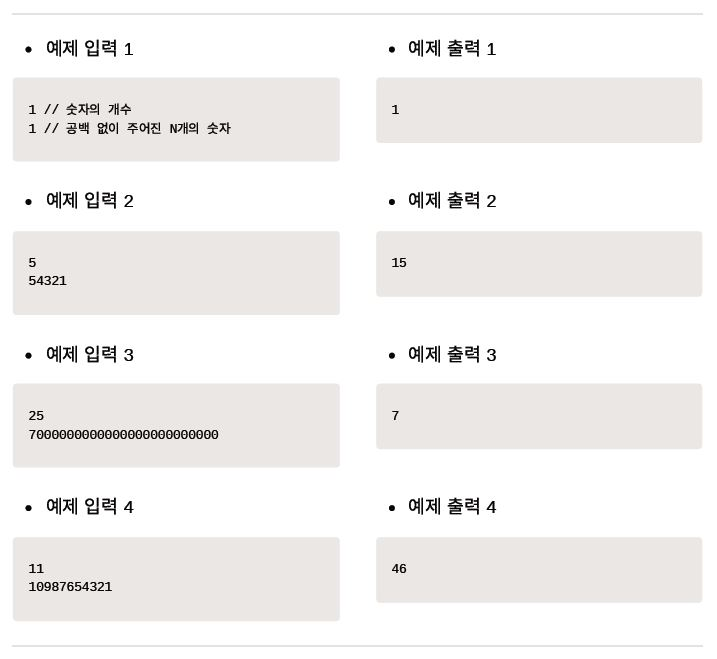

안녕하세요~👋

오늘도 공부하는 무럭무럭 ✨`성장몬`✨ 입니다. 

<br>

저는 문제가 주어지면 일단 코드부터 작성했는데...

이렇게 문제 분석부터 구현까지 차례대로 하면

실수나 오류도 많이 줄일 수 있을 거 같아요!

이 강의도 열심히 들어서 코딩테스트 박살내야지 ㅎㅎ

<br>

같이 성장하고 싶다면~?

+ [인프런](https://www.inflearn.com/) > [Do it! 알고리즘 코딩테스트 with JAVA](https://inf.run/kZnd) > 섹션 1. 자료구조(Data Structure) > [[배열과 리스트 실전 문제] 숫자의 합 구하기 (백준 11720)](https://www.inflearn.com/course/lecture?courseSlug=%EB%91%90%EC%9E%87-%EC%95%8C%EA%B3%A0%EB%A6%AC%EC%A6%98-%EC%BD%94%EB%94%A9%ED%85%8C%EC%8A%A4%ED%8A%B8-%EC%9E%90%EB%B0%94&unitId=148338)

+ [하루코딩](https://www.youtube.com/@codingtest) > [Do it! 알고리즘 코딩테스트 - 실전문제 풀이(JAVA)](https://youtube.com/playlist?list=PLFgS-xIWwNVU_qgeg7wz_aMCk22YppiC6) > [알고리즘 코딩테스트 문제풀이 강의 - 1 숫자의 합 구하기 (백준 11720)](https://youtu.be/0uhy851SDng)

<br>

<br>

# 문제 001 숫자의 합 구하기

---

- 시간 제한 1초
- 난이도 브론즈
- 백준 온라인 저지 11720번


## 📝 **문제**

N개의 숫자가 공백 없이 써 있다. 이 숫자를 모두 합해 출력하는 프로그램을 작성하시오.

<br>

📥 입력

1번째 줄에 숫자의 개수 N(1 ≤ N ≤ 100), 2번째 줄에 숫자 N개가 공백 없이 주어진다.

📤 출력

입력으로 주어진 숫자 N개의 합을 출력한다.



<br>

<br>

## 💙 01단계 | 문제 분석하기

N의 범위가 1부터 100가지이므로 값을 in형, long형과 같은 숫자형으로 담을 수 없습니다. 

먼저 문자열 형태로 입력값을 받은 후 이를 문자 배열로 변환하고, 문자 배열값을 순서대로 읽으면서 숫자형으로 변환하여 더해야 합니다. 예를 들어 입력값을 "1234"와 같이 문자열로 입력받은 후 이를 다시 '1', '2', '3', '4'와 같이 문자 배열로 변환하고, 다시 문자 배열을 1, 2, 3, 4,로 변환한 다음 더해 10을 구합니다.

> 문자열을 숫자형으로 변경하려면 아스키코드를 이해하고 있어야 합니다. 아스키코드에서 같은 의미의 문자와 숫자의 코드 값 차이는 48입니다. 예를 들어 문자 '1'은 아스키코드 값이 49이므로 문자 '1'을 숫자 1로 변환하려면 '1'-48 또는 '1'-'0'과 같이 연산하면 됩니다.


<br>

## 💙 02단계 | 손으로 풀어 보기

1. 숫자의 개수만큼 입력받은 값을 String형으로 저장합니다.
2. String형으로 입력받은 값을 char[]형으로 변환합니다.
3. 인덱스 0부터 끝까지 배열을 탐색하며 각 값을 정수형으로 변환하고 결괏값에 더하여 누적합니다.

<br>

## 💙 03단계 | 슈도코드 작성하기

```tex
N값 입력받기
길이 N의 숫자를 입력받아 String형 변수 sNum에 저장하기
sNum을 다시 char []형 변수 cNum에 변환하기 저장하기
int형 변수 sum 선언하기
for(cNum 길이만큼 반복하기)
{
	배열의 각 자릿값을 정수형으로 변환하며 sum에 더하여 누적하기
}
sum 출력하기
```

<br>

## 💙 04단계 | 코드 구현하기

```java
import java.util.Scanner;

public class P11720_숫자의합 {
	public static void main(String[] args) {
		Scanner sc = new Scanner(System.in);
		int N = sc.nextInt();
		// 입력값을 String형 변수 sNum에 저장한 후 char[]형 변수로 변환하기
		String sNum = sc.next();
		char[] cNum = sNum.toCharArray();
		int sum = 0;
		for(int i= 0; i < cNum.length; i++) {
			sum += cNum[i] - '0'; // cNum[i]를 정수형으로 변환하면서 sum에 더하여 누적하기
		}
		System.out.print(sum);
	}
}
```

<br>

<br>

<br>