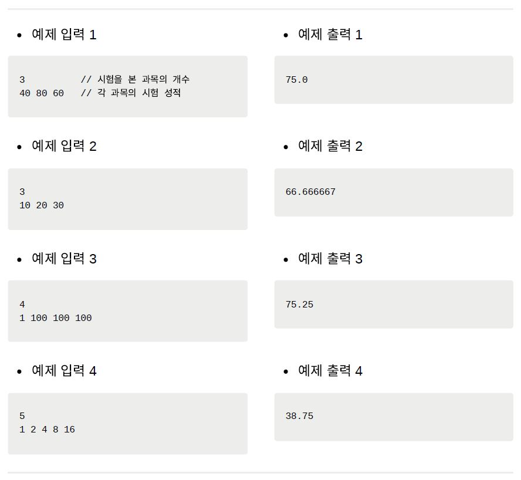

안녕하세요~👋

오늘도 공부하는 무럭무럭 ✨`성장몬`✨ 입니다. 

<br>

제가 조금 이해가 안 되는 부분이

문제에서 점수를 최댓값으로 나누고 100을 곱한다고 했는데

`System.out.println(sum/max*100.0/N);` 

이렇게 강의에서 구현하는 코드와 다르게

`/max`와 `*100.0`의 순서를 바꾸면 출력값이 틀려요!

<br>

제가 고민해 본 바로는 `sum`과 `max` 를 long형으로 선언했기 때문인 거 같아요!

double형으로 선언하니까 예제의 출력값이 잘 나오더라구요!

쉽지 않다...😂

<br>

같이 성장하고 싶다면~?

+ [인프런](https://www.inflearn.com/) > [Do it! 알고리즘 코딩테스트 with JAVA](https://inf.run/kZnd) > 섹션 1. 자료구조(Data Structure) > [[배열과 리스트 실전 문제] 평균 구하기 (백준 1546)](https://www.inflearn.com/course/lecture?courseSlug=%EB%91%90%EC%9E%87-%EC%95%8C%EA%B3%A0%EB%A6%AC%EC%A6%98-%EC%BD%94%EB%94%A9%ED%85%8C%EC%8A%A4%ED%8A%B8-%EC%9E%90%EB%B0%94&unitId=148339)

+ [하루코딩](https://www.youtube.com/@codingtest) > [Do it! 알고리즘 코딩테스트 - 실전문제 풀이(JAVA)](https://youtube.com/playlist?list=PLFgS-xIWwNVU_qgeg7wz_aMCk22YppiC6) > [알고리즘 코딩테스트 문제풀이 강의 - 2 평균 구하기 (백준 1546)](https://youtu.be/31Z1tH5frYY)

<br>

<br>

# 문제 002 평균 구하기

---

- 시간 제한 2초
- 난이도 브론즈 Ⅰ
- 백준 온라인 저지 1546번


## 📝 **문제**

세준이는 기말고사를 망쳤다. 그래서 점수를 조작해 집에 가져가기로 결심했다. 일단 세준이는 자기 점수 중 최댓값을 골랐다. 그런 다음 최댓값을 M이라 할 때 모든 점수를 점수/M＊100으로 고쳤다. 예를 들어 세준이의 최고점이 70점, 수학 점수가 50점이라면 수학 점수는 50/70＊100이므로 71.43점이다. 세준이의 성적을 이 방법으로 계산했을 때 새로운 평균을 구하는 프로그램을 작성하시오.

<br>

📥 입력

1번째 줄에 시험을 본 과목의 개수 N이 주어진다. 해당 값을 1,000보다 작거나 같다. 2번째 줄에 세준이의 현재 성적이 주어진다. 해당 값은 100보다 작거나 같은, 음이 아닌 정수이고, 적어도 1개의 값은 0보다 크다.

📤 출력

1번째 줄에 새로운 평균을 출력한다. 실제 정답과 출력값의 절대 오차 또는 상대 오차가 10<sup>-2</sup>이하이면 정답입니다.




<br>

<br>

## 💙 01단계 | 문제 분석하기

최고 점수를 기준으로 전체 점수를 다시 계산해야 하므로 모든 정수를 입력받은 후에 최고점을 별도로 저장해야 합니다. 또한 문제에서 제시한 한 과목의 점수를 계산하는 식은 총합과 관련된 식으로 변환할 수 있습니다. 따라서 일일이 변환 점수를 구할 필요 없이 한번에 변환한 점수의 평균 점수를 구할 수 있습니다.

> 변환 점수의 평균을 구하는 식(점수가 A, B, C인 경우)

```java
(A / M * 100 + B / M * 100 + C  / M * 100) / 3 = (A + B + C) * 100 / M / 3
```


<br>

## 💙 02단계 | 손으로 풀어 보기

1. 점수를 1차원 배열에 저장합니다.
2. 배열을 탐색하며 최고 점수와 점수의 총합을 구합니다.
3. ‘총합 * 100 / 최고 점수 / 과목의 수’를 계산해 다시 계산한 점수의 평균값을 출력합니다.

<br>

## 💙 03단계 | 슈도코드 작성하기

```tex
변수 N에 과목의 수 입력받기
길이가 N인 1차원 배열 A[] 선언하기
for(A[] 길이만큼 반복하기) {
	A[i]에 각 점수 저장하기
}
for(A[] 길이만큼 반복하기) {
	※최고점은 변수 max에, 총점은 변수 sum에 저장하기
}
sum * 100 / max / N 출력하기
```

<br>

## 💙 04단계 | 코드 구현하기

```java
import java.util.Scanner;

public class P1546_평균구하기 {
    public static void main(String[] args) {
        Scanner sc = new Scanner(System.in);
        int N = sc.nextInt();
        int A[] = new int[N];
        for(int i = 0; i < N; i++) {
            A[i] = sc.nextInt();
        }

        long sum = 0;
        long max = 0;
        for(int i = 0; i < N; i++) {
            if(A[i] > max) max = A[i];
            sum = sum + A[i];

        }
        System.out.println(sum*100.0/max/N);
    }
}
```

 또는

```java
import java.util.Scanner;

public class P1546_평균구하기 {
    public static void main(String[] args) {
        Scanner sc = new Scanner(System.in);
        int N = sc.nextInt();

        long sum = 0;
        long max = 0;
        for(int i = 0; i < N; i++) {
            int temp = sc.nextInt();
            if(temp > max) max = temp;
            sum = sum + temp;

        }
        System.out.println(sum*100.0/max/N);
    }
}
```

<br>

<br>

<br>